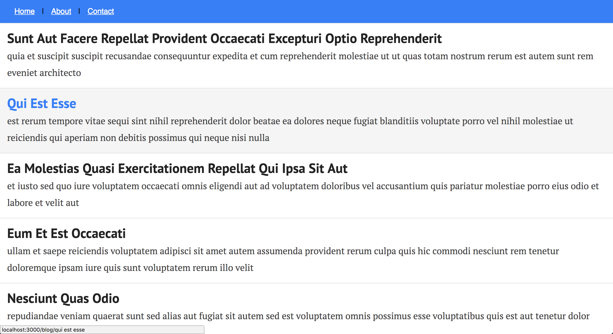

### Next.js Go

Read more here: https://medium.com/styled-components/building-a-blog-with-next-js-359cf1236574

Production ready Next.js app with the following:

- [x] Next.js 4.X
- [x] absolute imports
- [x] styled-components
- [x] eslint with [standard](https://github.com/standard/standard)
- [x] next-routes
- [x] express
- [ ] timber logging

### Preview:

Some basic styles are included, they look like:

